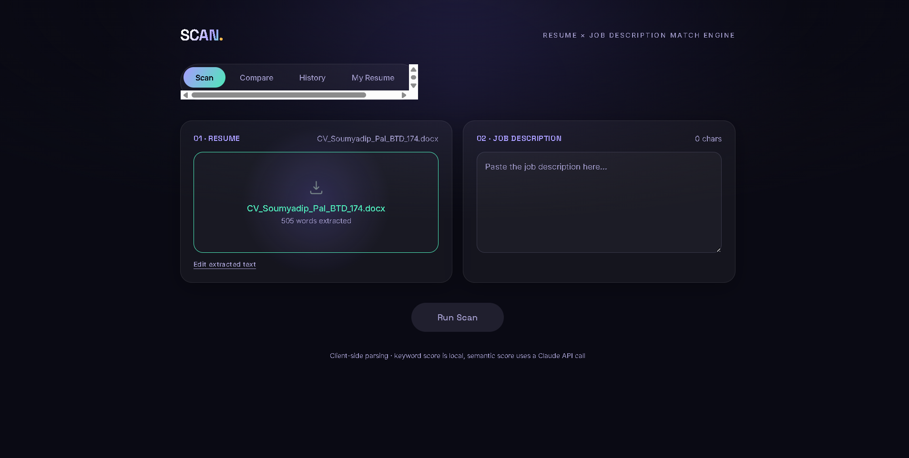

# SCAN — Resume × JD Match Engine

**Live site:** [scan-resume-matcher-one.vercel.app](https://scan-resume-matcher-one.vercel.app)



An ambient 3D resume-to-job-description match tool. Upload a resume (PDF/DOCX), paste a job
description, and get a keyword score (computed locally, instantly) blended with an AI semantic
fit score powered by the Claude API.

## Features

- **Scan** — drag-and-drop resume upload (PDF/DOCX parsed entirely in-browser), paste a job
  description, get a blended keyword + AI semantic match score, ATS format checks, and
  improvement suggestions. Export the result as a PDF report.
- **Compare** — score one resume against multiple job descriptions at once and see them ranked
  by fit.
- **History** — every scan is saved locally so you can track past matches over time.
- **My Resume** — a live-rendered preview of the resume behind this project, with a `.docx`
  download.

## Tech stack

- **Frontend:** React + TypeScript + Vite
- **3D/visuals:** Three.js via react-three-fiber, @react-three/drei
- **File parsing:** pdfjs-dist (PDF), mammoth (DOCX) — all client-side
- **Reports:** jsPDF
- **Backend:** Vercel serverless function (`/api/match`) calling the Anthropic API for semantic
  fit scoring

## Run it locally

```bash
npm install
npm run dev
```

Opens at `http://localhost:5173`. The keyword-scoring side of Scan/Compare works without a
backend; the semantic score needs `/api/match`, which only runs under Vercel (see below).

To test the real backend locally, install the Vercel CLI:

```bash
npm install -g vercel
cp .env.example .env      # then paste in your real ANTHROPIC_API_KEY
vercel dev
```

## Deploy your own copy

1. Get an API key at [console.anthropic.com](https://console.anthropic.com/settings/keys) and
   make sure the account has billing/credit attached.
2. Push this repo to your own GitHub account.
3. Import it on [vercel.com](https://vercel.com) — Vite is auto-detected.
4. Add an environment variable: `ANTHROPIC_API_KEY` = your key.
5. Deploy.

## Project structure
